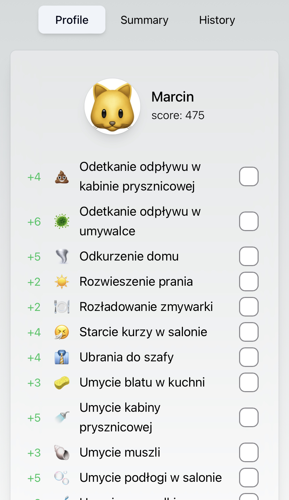
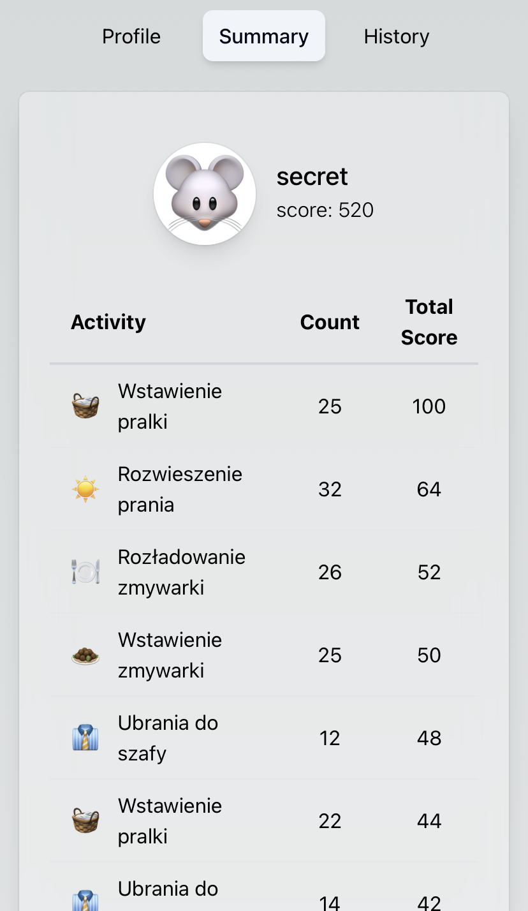
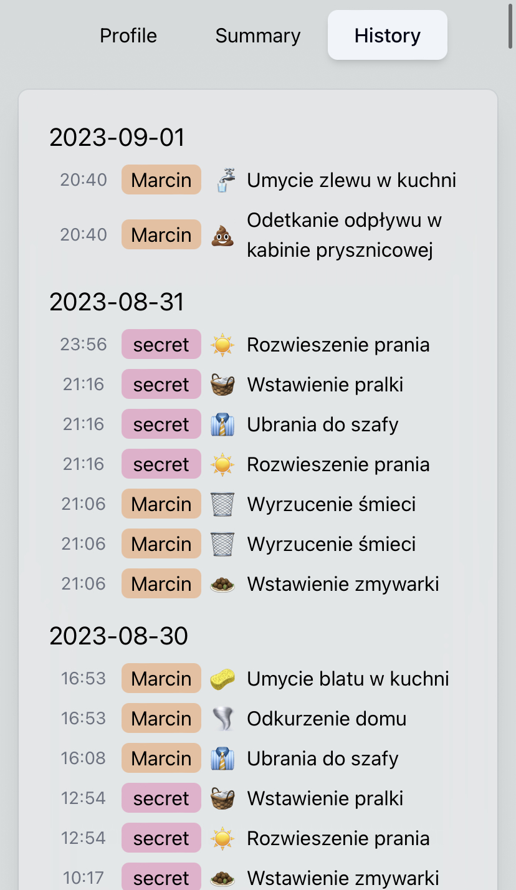
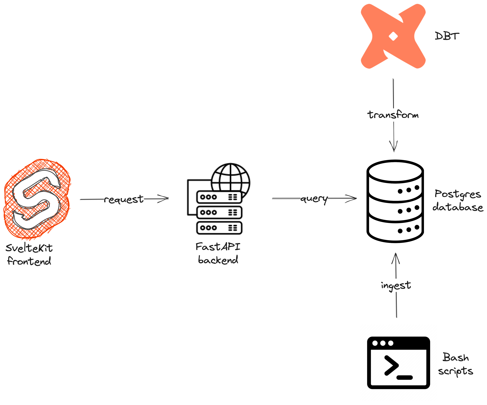

# Home Credit System
Web application turning boring household activities into a never ending competition game.

## Screenshots
<table>
<tr>
<td>

</td>
<td>

</td>
<td>

</td>
</tr>
<tr>
<td align="center">Profiles Page</td>
<td align="center">Summary Page</td>
<td align="center">History Page</td>
</tr>
</table>

## Who is this for?
The app was designed specificly for roommates and couples, who are struggling to establish a fair and equal division of effort put into household activities.

## Architecture


## Installation
1. Clone the repository and build the application
```
git clone https://github.com/mtyszkiewicz/home-credit-system.git
cd home-credit-system
docker compose up -d
```
2. Update users and activities data by going into `ingestion/queries/` directory and editing `users.sql` and `activities.sql`. Then run `./reload.sh` to apply the changes to the database.

## Usage
The frontend application can be accessed at `http://localhost:5173/?access_token=<access_token>` where `<access_token>` is uniqely assigned to each user in `users.sql` file. This way every user can easily access app without any login process.

If you just run the application you can access my account at http://localhost:5173/?access_token=ef1bc109-7495-4c2c-8307-3a0f9430603d.
