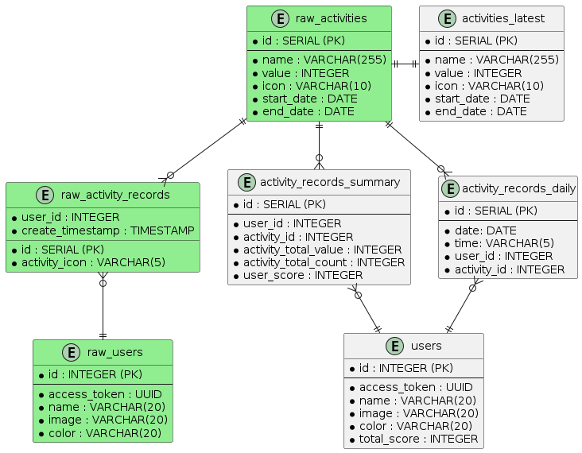

# Data Model

## Endpoints

### GET `/auth?access_token=...`
User authentication and authorization endpoint. Provided valid *access_token* returns the user.
- Loads from **users**

### GET `/users`
Returns all users.
- Loads from **users**

### GET `/users/{user_id}`
Provided *user_id* returns the user.
- Loads from **users**

### POST `/users/{user_id}/activity_records`
Provided *user_id* and *activity_id* creates an activity record for the user.
- Updates **raw_activity_records**

### GET `/activity_records`
Returns activity records history organized by day (date).
- Loads from **activity_records_daily**

### GET `/activity_summary`
REturns activity records aggregations by user.
- Loads **activity_records_summary**